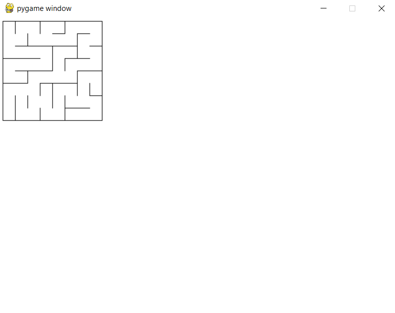

An arbitrary n*n grid was successfully generated. I used recursive backtracking. Please run the "main.py" for the random maze
generating program. 

Please see the "cell.py", "edge.py", "grid.py", and "mazegenerator.py" files for details. Remaining files were used for debugging

#### A random maze generated by the code

I am working on sending stream of command streams that will solve the generated maze. So far I have the basic client-server ready, but some timing issues persists.